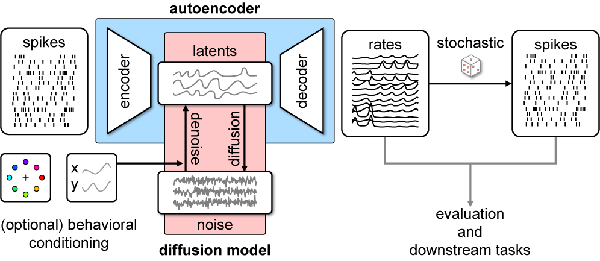

# Latent Diffusion for Neural Spiking Data




This repository contains research code for the NeurIPS 2024 paper:   
 [***Latent Diffusion for Neural Spiking Data***](https://arxiv.org/abs/2407.08751)   
 by [Kapoor*](https://jkapoor.me), [Schulz*](https://www.linkedin.com/in/auguste-schulz-b5a57a168/), [Vetter](https://www.linkedin.com/in/julius-vetter-060ab11b8?originalSubdomain=de), [Pei](https://www.linkedin.com/in/felix-pei-b41742196/), [Gao†](https://www.rdgao.com), and [Macke†](https://mackelab.org) (2024).


## Installation

To run the scripts make sure to first install all the requirements. We recommend creating a conda environment first.
A GPU is recommend but not necessary.

```bash 
git clone git@github.com:mackelab/LDNS.git
cd LDNS
conda create --name ldns python=3.9
conda activate ldns
pip install -e . # install from requirements.txt
# optional: install jupyter notebook
pip install jupyter
```

### Downloading human and monkey data

If you want to run the experiments on the human and monkey data, download and store the datasets:
- Monkey data: https://dandiarchive.org/dandiset/000128 (download using `dandi download DANDI:000128/0.220113.0400` in `data/monkey`)
- Human data (Willet et al, 2023): https://datadryad.org/stash/downloads/file_stream/2547369 (download in `data/human`, then unzip using `tar -xvf data/human/2547369`)


## Running the experiments

The core model and data loading code is in the [`ldns` directory](ldns). Training and evaluation is done in .ipynb files in the [`notebooks` directory](notebooks).
| Dataset | Train and Evaluate | Notebook |
|---------|-------------------|----------|
| **Lorenz system** | train ae | [`notebooks/train_autoencoder_Lorenz.ipynb`](notebooks/train_autoencoder_Lorenz.ipynb) |
| | train diffusion | [`notebooks/train_diffusion_Lorenz.ipynb`](notebooks/train_diffusion_Lorenz.ipynb) |
| | evaluate | [`notebooks/plotting_diffusion_Lorenz.ipynb`](notebooks/plotting_diffusion_Lorenz.ipynb) |
| | LFADS length gen | [`notebooks/LFADS_Lorenz_length_generalization.ipynb`](notebooks/LFADS_Lorenz_length_generalization.ipynb) |
| **Human BCI data** | train ae | [`notebooks/train_autoencoder_human.ipynb`](notebooks/train_autoencoder_human.ipynb) |
| | train diffusion | [`notebooks/train_diffusion_human.ipynb`](notebooks/train_diffusion_human.ipynb)`|
| | evaluate | [`notebooks/plotting_diffusion_human.ipynb`](notebooks/plotting_diffusion_human.ipynb)`|
| **Monkey reach data** <br> | train ae | [`notebooks/train_autoencoder_monkey.ipynb`](notebooks/train_autoencoder_monkey.ipynb) |
| | train diffusion (unconditional) | [`notebooks/train_diffusion_monkey.ipynb`](notebooks/train_diffusion_monkey.ipynb) |
| | train diffusion (angle-conditioned) | [`notebooks/train_and_plot_diffusion_monkey_angle_conditioned.ipynb`](notebooks/train_and_plot_diffusion_monkey_angle_conditioned.ipynb) |
| | train diffusion (velocity-conditioned) | [`notebooks/train_and_plot_diffusion_monkey_velocity_conditioned.ipynb`](notebooks/train_and_plot_diffusion_monkey_velocity_conditioned.ipynb) |
| | train spike history | [`notebooks/train_spike_history_monkey.ipynb`](notebooks/train_spike_history_monkey.ipynb) |
| | evaluate (unconditional) | [`notebooks/plotting_diffusion_monkey_unconditional_with_baselines.ipynb`](notebooks/plotting_diffusion_monkey_unconditional_with_baselines.ipynb) |


### Checkpoints and spike samples
For better reproducibility, we provide the checkpoints and spike samples for the experiments in this [OneDrive](https://unitc-my.sharepoint.com/:f:/g/personal/iiojk01_cloud_uni-tuebingen_de/EjX79NZTjzhEmUej_ZzOn-cBD1qCW85DGChJFXxOWiJpcw?e=9s5lz1) link. Please download the artifacts and spike samples in the `exp/stored_models` and `exp/stored_spike_samples` directory, and appropriately change the paths in the plotting notebooks.

## Baselines for the Lorenz and Monkey Reach Data

In the paper, we compared LDNS to a number of VAE-based baselines. The code for these baselines can be found in the [`baselines`](baselines) directory.

The code for [LFADS (Pandarinath et al, 2018)](https://www.nature.com/articles/s41592-018-0109-9) can be found in the [`baselines/lfads`](baselines/lfads) directory. We quantitatively compare LFADS samples with LDNS on the unconditional Monkey reach data, and in supplementary material, qualitatively compare the length generalization of LFADS with LDNS on the Lorenz dataset.

We additionally use [TNDM (Hennig et al, 2021)](https://arxiv.org/abs/2110.14853) and [pi-VAE (Zhou et al, 2020)](https://arxiv.org/abs/2011.04798) as baselines for the unconditional monkey reach data in supplementary material. The code for TNDM can be found in the [`baselines/tndm`](baselines/tndm) directory, and the code for pi-VAE can be found in the [`baselines/pivae.py`](baselines/pivae.py) file.

After training, rates are sampled and stored by running code in [`baselines/lfads/sample_lfads.ipynb`](baselines/lfads/sample_lfads.ipynb), and the TNDM and pi-VAE samples are stored in [`baselines/tndm/tndm_reach.ipynb`](baselines/tndm/tndm_reach.ipynb) and [`baselines/pivae.py`](baselines/pivae.py) respectively. We use these samples for comparisons in the corresponding analysis notebooks in the [`notebooks`](notebooks) directory.

The spike samples are provided in the link above.

## Citation

```
@inproceedings{kapoorschulz2024ldns,
	author = {Jaivardhan Kapoor and Auguste Schulz and Julius Vetter and Felix C Pei and Richard Gao and Jakob H. Macke},  
	title = {Latent Diffusion for Neural Spiking Data},  
	journal = {Advances in Neural Information Processing Systems},
	year = {2024}  
}
```
## Contact
Please open a Github issue for any questions, or send an email to jaivardhan.kapoor@uni-tuebingen.de or auguste.schulz@uni-tuebingen.de.
